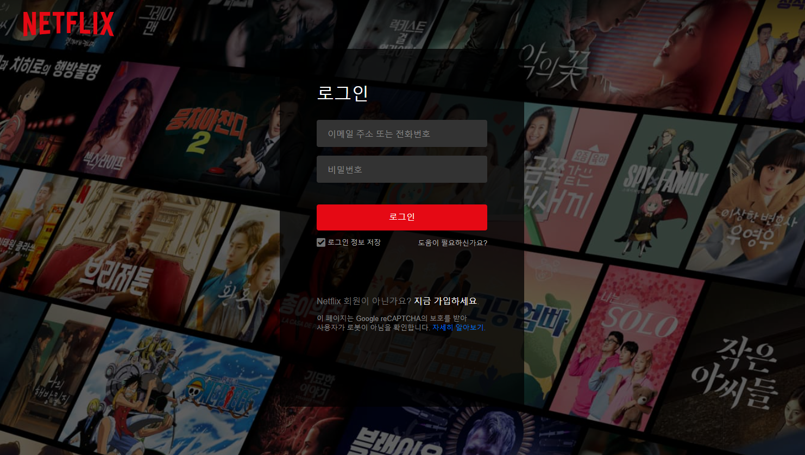
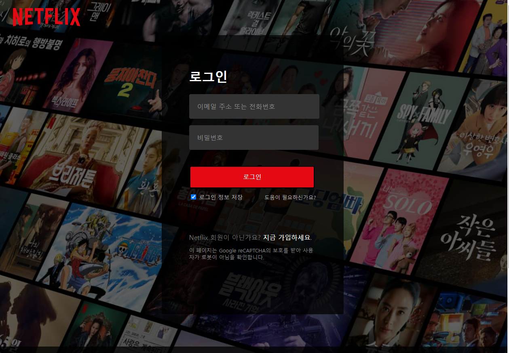
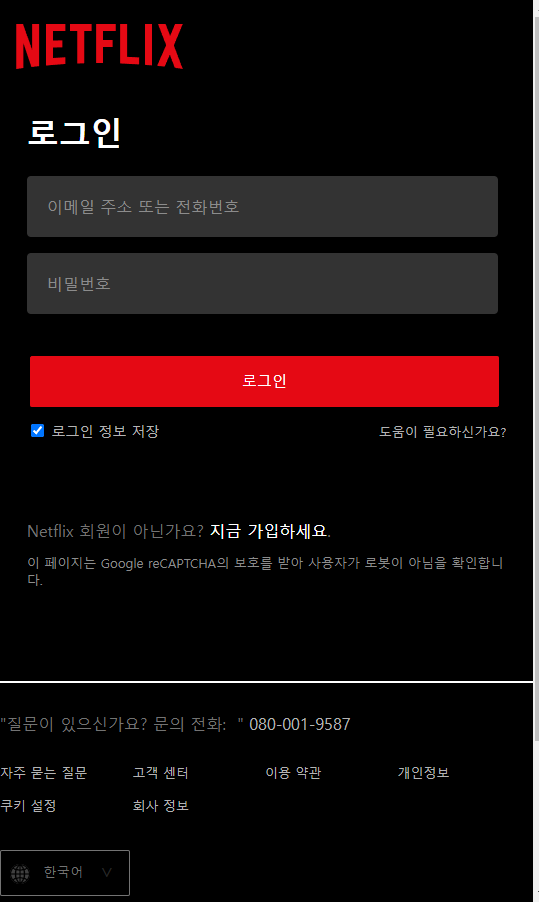

# Neflix Clone Coding

- 사용 기술스택: HTML, CSS, JS
- 사용 API : TMDB API

## 구현 할 페이지 3개 선정

- 초기화면<br>
    - <br><br><br>

- main페이지<br>
    - <br><br><br>

- 로그인
    - <br><br><br>


## 초기화면(landing page)

    초기화면 - 특징
    1) selector 커스텀
    2) email 입력창 focus => 가이드 메세지 발생


    구현부
    ```
    /** Netflix 원본은 텍스트 옆 지구본과 화살표를 ::after ::before를 사용했지만 화면상에 나타나지 않아서 div태그로 만들어서 넣어주었다. */
    //index.css
    .globe-icon {
        position: relative;
        left: 2.02rem;
        width: 0.88rem;
        height: 0.88rem;
        border-radius: 100%;
        background-color: white;
        background-image: url("../assets/globe.png");
        background-repeat: no-repeat;
        background-size: 0.88rem;
        transform: translateY(100%);
    }

    .triangle {
        z-index: 0;
        position: relative;
        right: 2.1rem;
        width: 0.9rem;
        height: 0.7rem;
        background-color: rgba(0, 0, 0, 0);
        background-image: url("../assets/selectTriangle.png");
        background-repeat: no-repeat;
        background-size: 0.8rem;
        transform: translateY(125%);
    }

    #lang-select {
        box-sizing: border-box;
        z-index: 1000;
        position:relative;
        top: 2px;
        appearance: none;
        -webkit-appearance: none;
        -moz-appearance: none;
        border: 1px solid #aaa;
        background-color: rgba(0,0,0,.2);
        color: white;
        text-align: center;
        width: 6rem;
        height: 2.3rem;
        font-size: 0.88rem;
        border-radius: 3px 3px;
        padding: 0.5rem 0.8rem;
        margin: 0px 9px;
    }

        //index.html - 이메일 입력창 
        <form class="email-form">
            <h3>시청할 준비가 되셨나요? 멤버십을 등록하거나 재시작하려면 이메일 주소를 입력하세요.</h3>
            <div class="form-outline" >
                <div class="email">
                    <label for="email-address">이메일 주소</label>
                    <input type="email" id="email-address" autocomplete="off"/>
                </div>
                <button><a id="go-to-main" href="./main.html" style="padding: 0;">시작하기 ></a></button>
            </div>
        </form>


        //index.js
        let emailInput = document.querySelector("#email-address");
        let emailLabel = document.querySelector('label[for="email-address"]');
        let emailGuide = document.createElement("div");
        let emailDiv = document.querySelector(".email");
        let emailForm = document.querySelector(".email-form");

        emailGuide.innerText="이메일 주소를 입력해주세요.";
        emailGuide.style.color="#FFA00A";
        emailGuide.style.textAlign="left";
        emailGuide.style.margin="0 0 0 110px";

        //email 입력창에 focus 발생 시, "이메일 주소를 입력해주세요." 안내멘트
        emailInput.addEventListener('focus', e => {
            emailLabel.style.fontSize = "12px";
            emailLabel.style.top = "-23px";
            emailDiv.append(emailGuide); 
            emailInput.style.margin="0 0 0 41px";
        });


        /**
        email 입력창 focus 해제 시,
        입력창이 비어있다면 원래 상태로 돌아옴.
        입력창에 값이 입력되어있다면 현재 상태 유지.
        */
        emailInput.addEventListener('blur', e => {
            if(emailInput.value.length === 0) {
                emailLabel.style.fontSize = "16px";
                emailLabel.style.top = "-2px";
                emailInput.style.margin="0 0 0 20px";
                emailDiv.removeChild(emailGuide);
            }
        })
    ```

<br><br><br><br>
## Main페이지

    Main페이지 - 특징
    - TMDB api를 사용하여 carousel 제작
        - baseURL: https://api.themoviedb.org/3
        - posterURL: https://image.tmdb.org/t/p/original/[poster_path] (No Need API_KEYS)
        - GET `/movie/popular`
            - 지금 뜨는 컨텐츠
                - `https://api.themoviedb.org/3/movie/popular?api_key=<<api_key>>&language=en-US&page=1`
        - GET `/movie/now_playing`    
            - 최신순
                - `https://api.themoviedb.org/3/movie/now_playing?api_key=<<api_key>>&language=en-US&page=1`
        - GET `/movie/upcoming/`    
            - 상영 예정
                - `https://api.themoviedb.org/3/movie/upcoming?api_key=${API_KEY}&language=en-US&page=1`

    Main페이지 - 주요 기능.

    1) scrollbar를 내리면 `header`의 배경색이 투명 => 검정으로 변화
    2) carousel => 영화 포스터 끝 부분에 마우스를 올려놓으면 화살표 생성, 화살표 클릭 시 무한 슬라이드.
    3) header의 돋보기 아이콘 클릭시, 검색창이 옆으로 늘어나면서 생성됨

    ```
        /** 1) 스크롤로 창을 올릴 경우, header의 색이 검정색이 됨 */
        window.addEventListener("scroll", e => {
            if(window.pageYOffset > 0 ) {
                headerContainer.style.cssText = `
                    background: black;
                    transition: .4s;
                `;
            } else {
                headerContainer.style.cssText = `
                    background-image: linear-gradient(rgba(0, 0, 0, 0.72), rgba(0, 0, 0, 0.01)); 
                    transition: .4s;
                `;
            }
        });


        ==========================================================================================================

        /** 2) carousel */
        //main.css - 영화 포스터를 한 줄로 나열한 뒤, 20개의 포스터 중 가운데 6개의 포스터가 화면 가운데로 오게 함.
        .slide-container {
            display: flex;
            position: relative;
            margin: 0 0 0 -112vw;
        }


        //main.js

        //button 클릭시 .slide-container를 img 6개 크기만큼 옆으로 이동하는 애니메이션(transition) 발생
        //ontransitionend => transition 종료 후 실행할 동작을 구현
        //transition 종료 후, 이동 방향 이미지 6개를 반대편으로 보낸 뒤,
        //viewport상에 나타날 .slide-container의 위치는 다시 제자리로 돌려준다. 
        //일종의 눈속임.

        /** carousel - 1*/
        const prevBtn1 = document.querySelector('#prev-one');
        const nextBtn1 = document.querySelector('#next-one');

        prevBtn1.addEventListener("click", e => { 
            const container = document.querySelector('#slide-container-one');
            container.style.transform = `translateX(${1 * (100 / 20 * 6)}%)`;
            container.style.transitionDuration = '.8s';

            container.ontransitionend = () => { 
                container.style.removeProperty("transform", "none");
                container.style.removeProperty("transition-duration", "none");
                for(let i = 0; i < 6; i++) {
                    container.prepend(container.removeChild(container.childNodes[container.childNodes.length - 1]));
                }
            };
        });
    
    =================================================================================================================

        3) 돋보기 아이콘 클릭 시, input 생성

        //main.html
        //
         <div class="search-box">
            <button class="search-tab" tabindex="0" aria-label="검색">
                <svg width="24" height="24" viewBox="0 0 24 24" fill="none" xmlns="http://www.w3.org/2000/svg" class="search-icon"><path fill-rule="evenodd" clip-rule="evenodd" d="M13 11C13 13.7614 10.7614 16 8 16C5.23858 16 3 13.7614 3 11C3 8.23858 5.23858 6 8 6C10.7614 6 13 8.23858 13 11ZM14.0425 16.2431C12.5758 17.932 10.4126 19 8 19C3.58172 19 0 15.4183 0 11C0 6.58172 3.58172 3 8 3C12.4183 3 16 6.58172 16 11C16 11.9287 15.8417 12.8205 15.5507 13.6497L24.2533 18.7028L22.7468 21.2972L14.0425 16.2431Z" fill="currentColor"></path></svg>
            </button>
        </div>
        <div class="search-div">
            <input class="search-input" type="text" placeholder="제목, 사람, 장르">
        </div>


        //main.css
        //초기 화면에 input을 담은 search가 나타나지 않게함. `width: 0, border: 0, visibility: hidden`
        .search-div {
            display: flex;
            visibility: hidden;
            background: linear-gradient(rgba(0, 0, 0, 0.6), rgba(0, 0, 0, 0.4));
            position: absolute;
            align-items: center;
            border: 0;
            padding: 0 13px;
            right: 195px;
            width: 0;   
            height: 40px;
        }

        .search-input {
            height: 35px;
            width: 0;
            color: white;
            outline: none;
            background: transparent;
            border: 0; 
            padding: 0 0 0 8px;
        }


        //main.js
        //아이콘 클릭 시, visibility: visible로 변화. 화면에 나타남.
        searchTab.addEventListener('click', e => {
        searchBox.style.display = "none";
        searchDiv.prepend(searchIcon);
        searchDiv.style.cssText = `
            visibility: visible;
            border: 1px solid white;
            transform: scaleX(1);
            transition: .4s;
            width: 220px;
        `;

        searchInput.style.cssText = `
            margin: -3px 0 0 0;
            width: 130px;
        `;
    });

    //돋보기 아이콘 이외에 다른 곳 클릭 시, input창이 사라짐.
    const body = document.querySelector('body');
    body.addEventListener ('click', e => {
        if(e.target == e.currentTarget.querySelector('.search-input') ||
            e.target == e.currentTarget.querySelector( '.search-icon') ||
            e.target == e.currentTarget.querySelector('.search-div')
        ) {
                return;
        }

        searchBox.style.display = "inline-block";
        searchTab.append(searchIcon);
        searchDiv.style.removeProperty("transform", "none");
        searchDiv.style.removeProperty("transition", "none");
        searchInput.style.removeProperty("margin", "none");

        searchDiv.style.cssText=`
            visibility: hidden;
            border: 0;
            width: 0;
        `;

        searchInput.style.cssText = `
            width: 0;
        `;
    })
    ```           
<br><br><br><br>
## login페이지 - media query, img태그의 srcset 사용.
-login페이지 - *특징(740px미만일 때, 로그인 모달창만 화면에 나타남.)*<br>
`@media (min-width: 740px)`을 통해 구현 <br>
    - 
    - 

    loing페이지 주요 기능
    - password, id창을 클릭 시, 안내 문구가 작아지며 위로 이동함.
    - password의 경우 비밀번호를 입력하면 `비밀번호 표시, 숨기기`버튼이 생김.

    ``` //login부분
        //login창에 focus 발생 시, 안내 멘트가 위로 올라감
        //focus 해제 시, input창이 비어있으면, 안내멘트 원상복구
        loginInput.addEventListener('focus', e => {
            if(loginInput.value === "") {
                loginLabel.style.cssText = `
                    top: 50%;
                    font-size: 16px;
                    background-color: #333;
                `;
                loginInput.style.cssText = `
                    background-color: #333;
                `;
            }
        }

    loginInput.addEventListener('blur', e => {
        loginLabel.style.cssText = `
            top: 50%;
            font-size: 16px;
            background-color: #333;
        `;
        loginInput.style.cssText = `
            background-color: #333;
        `;
    });


    //password부분
    //login과 마찬가지.
    //추가 기능: 비밀번호가 입력중인 상태면, `표시`버튼이 나타나서 비밀번호를 눈으로 확인할 수 있다.
    passwordInput.addEventListener('focus', e => {
        passwordLabel.style.cssText=`
            top: 20%;
            font-size: 8px;
            background-color: #4e4e4e;
        `;
        passwordInput.style.cssText = `
            background-color: #4e4e4e;
            appearence: none;
        `;

        passwordType.style.cssText = `
            visibility: visible;
        `;
    })

    passwordInput.addEventListener('blur', e => {
        if(passwordInput.value == "") {
            passwordLabel.style.cssText = `
            top: 50%;
            font-size: 16px;
            background-color: #333;
            `;
            passwordInput.style.cssText = `
                background-color: #333;
            `;

            passwordType.style.cssText = `
                visibility: hidden;
            `;
        }
    });

    passwordType.addEventListener( 'click', e => {
        if(passwordType.innerText === '숨기기') {
            passwordType.innerText = '표시';
            passwordInput.setAttribute("type", "password");
        } else {
            passwordType.innerText = '숨기기';
            passwordInput.setAttribute("type", "text");
        }
    });
    ```
<br><br><br><br>
## 새로 알게 된 것.
- carousel 구현부 (`ontransitionend Event`)
    - transition Event 종료 후 발생.
    - carousel이 무한히 순환하는 것처럼 보이기 위한 눈속임으로 사용.
    - css의 특정 속성을 js로 제거하는 방법. `element.style.removeProperty( 스타일명 : string, none);`
- flex item의 넓이는 flex basis로.
- aria-label 이미를 사용해 시각적으로 표현할 경우 그 이미지를 설명하기 위한 대체 텍스트.
- vertical-align은 `inline` 혹은 `table-cell` box에서 수직정렬.
- js로 css 속성을 한 번에 여러 개 이상 설정할 경우 => `element.style.cssText = '';`


## 잘 못 알고 있던 것.

- async/await (await 부분을 만나면 await의 프라미스를 처리할 때까지 외부 함수 전체가 동기적으로 처리된다고 생각함.)
    - await 키워드의 경우 함수 내에서만 promise를 반환할 때까지 기다리고 외부 함수들은 여전히 비동기적으로 실행된다.